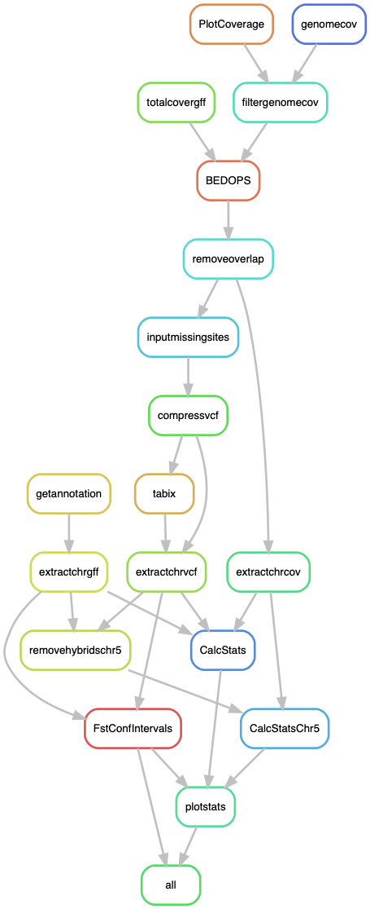

# DiversityStats: Calculate diversity estimates  *Podospora anserina*

This pipeline is meant to be run using the vcf files produced by `SNPpop.smk`. In particular it needs:

- The SNPs file in vcf
- The gff with the repeat masking on the reference genome (Podan2)
- The path to the `SNPpop.smk` run, so it can search for the BAM files. Those are needed to use deviations of coverage in individual samples.

The repo has also a folder called `data` with metadata of the samples used by the scripts in the folder `scripts`.

The output includes the Figures 1, 3, 6A, S2, and S5.

I ran the pipeline in a CentOS Linux environment in the slurm cluster [Uppmax](https://uppmax.uu.se/). It should work in a Mac OS too.

## Building the environment

The pipeline relies on the `DiversityStats` environment, which looks like this:

    $ conda update -n base conda

Now, to create the environment.

    $ conda create -n DiversityStats -c bioconda snakemake-minimal=5.4.4 vcftools=0.1.16
    $ conda activate DiversityStats

Install more tools to deal with coverage:

    $ conda install -c bioconda bedtools=2.28.0
    $ conda install -c bioconda bedops=2.4.36

To compress vcf files and make indexes:
    
    $ conda install -c bioconda htslib=1.9

To plot in R, I made a small conda environment, to avoid conflicts between packages.

    $ cat envs/statsplot.yaml
```yaml
channels:
  - bioconda
  - defaults
  - conda-forge
  - r
dependencies:
  - r-dplyr=0.8.3
  - r-tidyverse=1.2.1 # It comes with ggplot 3.0.0
  - r-cowplot=1.0.0
  - r-stringr=1.4.0
  - r-reshape2=1.4.3
  - r-hmisc=4.2_0 # Needed for stat_summary()
  - r-popgenome=2.6.1
  - r-vcfr=1.8.0
```

## Repeats

In order to remove "bad quality" sites, I basically assumed all the bad sites would come from repeated elements. Hence, I used the `gff` file produced with RepeatMasker from the pipeline `SNPpop.smk`:
    
    SNPpop/RepeatMasker/Podan2_AssemblyScaffoldsmt.fa.out.gff

The path to this gff is specified in the configuration file.

## Configuration file

This pipeline depends on a given configuration file including the samples, the path to the data, and the reference. The file looks like such:

```yaml
## List of samples to analyze
SampleIDs: ["PaWa1p", "PaWa1m", "PaWa2m", "PaWa3p", "PaWa3m", "PaWa4p", "PaWa7m", "PaWa8p", "PaWa9m", "PaWa10p", "PaWa11m", "PaWa12p", "PaWa13m", "PaWa14p", "PaWa15m", "PaWa16p", "PaWa17m", "PaWa18p", "PaWa19m", "PaWa21p", "PaWa21m", "PaWa22m", "PaWa23p", "PaWa24m", "PaWa25p", "PaWa26m", "PaWa27p", "PaWa27m", "PaWa28p", "PaWa28m", "PaWa29p", "PaWa32p", "PaWa32m", "PaWa33m", "PaWa36p", "PaWa37m", "PaWa38p", "PaWa39m", "PaWa40m", "PaWa41p", "PaWa42m", "PaWa43p", "PaWa44m", "PaWa45p", "PaWa46p", "PaWa46m", "PaWa47p", "PaWa47m", "PaWa49m", "PaWa52p", "PaWa53p", "PaWa53m", "PaWa54m", "PaWa55p", "PaWa56m", "PaWa57p", "PaWa58p", "PaWa58m", "PaWa59m", "PaWa60p", "PaWa61m", "PaWa62p", "PaWa63p", "PaWa63m", "PaWa64m", "PaWa66m", "PaWa67p", "PaWa68m", "PaWa69p", "PaWa70m", "PaWa71p", "PaWa72m", "PaWa76p", "PaWa77m", "PaWa78p", "PaWa79m", "PaWa81p", "PaWa83m", "PaWa85p", "PaWa85m", "PaWa86m", "PaWa87p", "PaWa87m", "PaWa88p", "PaWa89p", "PaWa91p", "PaWa92p", "PaWa94p", "PaWa95p", "PaWa96m", "PaWa97p", "PaWa98m", "PaWa99p", "PaWa100p", "PaWa100m1", "PaWa101m", "PaWa102p", "PaWa103m", "PaWa104m", "PaWa105p", "PaWa106p", "PaWa107m", "PaWa108m", "PaWa109p", "PaWa115m", "PaWa116p", "PaWa117m", "PaWa118p", "PaWa122m", "PaWa123p", "PaWa124p", "PaWa125m", "PaWa126p", "PaWa127m", "PaWa128p", "PaWa129p", "PaWa137m", "PaWa138m", "PaWa142p", "PaWa143m", "CBS433.50p", "CBS455.64m", "PaTgp", "PaYp", "PaZp", "PaSp"]

## The variants file produced by SNPpop.smk
vcf: "path/to/SNPpop/results/PodoPop-snps.vcf.gz"

## The gff of sites to replace for missing data, produced by SNPpop.smk
TEgff: "path/to/SNPpop/RepeatMasker/Podan2_AssemblyScaffoldsmt.fa.out.gff"

# Path to the BAM files produced by SNPpop.smk 
path2BAM: "path/to/SNPpop/mapping"

## Scripts
badsites2vcf: "scripts/badsites2vcf.py" # v. 1.2, in repo
totalcovergff: "scripts/totalcovergff.py" # v. 2.0, Available at: https://github.com/SLAment/Genomics/tree/master/GenomeAnnotation

# In the repo
DiversityStats_vcfR_plotter: "scripts/DiversityStats_vcfR_plotter.R"
DiversityStatsFstInterv: "scripts/DiversityStatsFstInterv.R"
DiversityStatsCalc: "scripts/DiversityStatsCalc.R"
DiversityStatsCalcPlot: "scripts/DiversityStatsCalcPlot.R"

# Metadata file
hetgenes: "data/PaAllelesPaper.csv"

# Number of chromosomes (assuming vcf has contigs names like "chromosome_1")
NCHR: 7
```

## Run pipeline in Uppmax

First, to get an idea of how the pipeline looks like we can make a rulegraph:

    $ conda activate DiversityStats
    $ snakemake --snakefile DiversityStats.smk --configfile DiversityStats_config.yml --rulegraph | dot -Tpng > tmp/rulegraph.png



For testing:

    $ snakemake --snakefile DiversityStats.smk --configfile DiversityStats_config.yml -pn

Run the pipeline:

    $ screen -R DiversityStats
    # Important to activate environment!!
    $ conda activate DiversityStats
    $ snakemake --snakefile DiversityStats.smk --configfile DiversityStats_config.yml -p --cluster "sbatch -A snicXXXX-X-XXX -p core -n {params.threads} -t {params.time} --mail-user xxxxxx@xxxxx.xx --mail-type=ALL" -j 20 --keep-going --use-conda &> DiversityStats.log &


## Run pipeline locally

The same, but do:

    $ conda activate DiversityStats
    $ snakemake --snakefile DiversityStats.smk --configfile DiversityStats_config.yml -p -j 20 --keep-going --use-conda &> DiversityStats.log &

# The Ecology Figures

Figures 6B and 6C are not part of the pipeline but use one of the files in the `data` folder. The script `scripts/PaEcology.R` can be run in Rstudio, for example, to get those figures.
