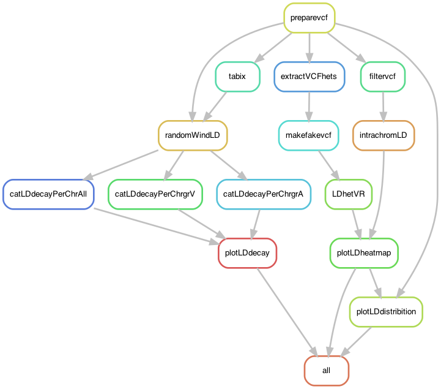

# PaLD: A pipeline to estimate linkage disequilibrium in *Podospora anserina*

This pipeline is meant to be run using the vcf file with no missing data produced by `SNPpop.smk`. The output are:

- LD decay per chromosome of the entire Wageningen Collection (Figure S3 in the paper), plus some extras 
- LD heatmap-like plot inspired in [Hench et al. (2019)](https://www.nature.com/articles/s41559-019-0814-5) (Figure S8)

In the code, I ofter refer to the "V" and "A" mating groups. These are equivalent to the V and V1 alleles of *het-v*.

I ran the pipeline in a CentOS Linux environment in the slurm cluster [Uppmax](https://uppmax.uu.se/). It should work in a Mac OS too.

## Building the environment

First, to update conda:

    $ conda update -n base conda

The pipeline relies on the `PaLD` environment, which looks like this:

    $ conda create -n PaLD -c bioconda snakemake-minimal=5.4.4 vcftools=0.1.16 bcftools=1.9

To compress vcf files and make indexes:
    
    $ conda activate PaLD    
    $ conda install -c bioconda htslib=1.9

I also have it in a yaml file in case I need to build it again:

    $ cat envs/PaLD.yaml
```yaml
channels:
  - bioconda
  - defaults
  - conda-forge
  - r
dependencies:
  - snakemake-minimal=5.4.4
  - vcftools=0.1.16
  - htslib=1.9
```

The pipeline also depends on a small yaml that act as local conda rules.

    $ cat envs/PaLDPlot.yaml
```yaml
channels:
  - bioconda
  - defaults
  - conda-forge
  - r
dependencies:
  - r-dplyr=0.8.3
  - r-cowplot=1.0.0 # It includes ggplot2
  - r-stringr=1.4.0
  - r-hexbin=1.27.3
  - r-gridextra=2.3 # It includes grid
```

## Run pipeline in Uppmax

First, to get an idea of how the pipeline looks like we can make a rulegraph:
    
    $ conda activate PaLD
    $ snakemake --snakefile PaLD.smk --configfile PaLD_config.yaml --rulegraph | dot -Tpng > rulegraph.png



For testing:

    $ snakemake --snakefile PaLD.smk --configfile PaLD_config.yaml -pn

Run the pipeline:

    $ screen -R PaLD
    # Important to activate environment!!
    $ conda activate PaLD
    $ snakemake --snakefile PaLD.smk --configfile PaLD_config.yaml -p --cluster "sbatch -A snicXXXX-X-XXX -p core -n {params.threads} -t {params.time} --mail-user xxxxxxxxxxxx@xxxxx.xx --mail-type=ALL" -j 20 --keep-going --use-conda &> PaLD.log &

## Run pipeline locally

The same, but do:

    $ snakemake --snakefile PaLD.smk --configfile PaLD_config.yaml -p -j 20 --keep-going --use-conda &> PaLD.log &
