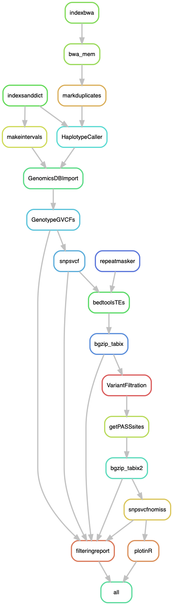

# SNPpop: Variant calling in *Podospora anserina*

This pipeline was designed to call SNPs in the whole genome and per chromosome to produce PCAs. It also produces the PCoA of mating data derived from the doctoral thesis of Marijn van der Gaag (2005). The necessary metadata is provided in this repository. The reference genome and the repeated elements library are available in the repository of the [Spok paper](https://github.com/johannessonlab/SpokPaper/tree/master/Fig4_S3_Backcrosses/extras).

Some of the resulting files from the pipeline (the SNPs in vcf format, the BAM files, the repeat masking of the reference genome) are used in subsequent pipelines `DiversityStats.smk` and `PaLD.smk`.

The output includes the Figure 2 and the components of S4, plus a plot with SNP correlation coefficients driven the PCA, but I didn't use that in the paper in the end.

## Building the environment

This pipeline relies on the VariantCallingGATK4 environment, which looks like this:

    $ conda update -n base conda

Now, to create the environment.

    $ conda create -n VariantCallingGATK4 -c bioconda snakemake-minimal=5.4.4 picard=2.19.0 bwa=0.7.17 samtools=1.9
    $ conda activate VariantCallingGATK4

In order to mask repeats, I also need RepeatMasker and accessories.

    $ conda install -c bioconda repeatmasker=4.0.8=pl526_13
    $ conda install -c bioconda bedtools=2.27.1=he941832_2
    $ conda install -c bioconda bcftools=1.9=ha228f0b_3
    $ conda install -c bioconda vcftools=0.1.16=he941832_2
    $ conda install -c bioconda eigensoft=7.2.1=hd1ccf6d_0

GATK4 is now available in conda:

    $ conda install -c bioconda gatk4=4.1.1.0=0  

To compress vcf files and make indexes:
    
    $ conda install -c bioconda htslib=1.9=hc238db4_4

The last part of the pipeline plots the result in R, so I created a small mini environment for it:
    
    $ cat envs/snprelate.yaml
```yaml
    channels:
      - bioconda
      - defaults
      - conda-forge
      - r
    dependencies:
      - r-dplyr=0.8.3
      - r-cowplot=1.0.0 # it includes ggplot
      - r-adegenet=2.1.1 # It includes the packages cluster and vegan
      - bioconductor-gdsfmt=1.20.0
      - bioconductor-snprelate=1.18.0
```

## Repeats

In order to mask repeats we used the sequences of the TEs described in Espagne et al. (or those that we could find), plus the RepBase database for fungi, and the *Neurospora* library from Gioti et al (2012). This is exactly the same library used in [Vogan et al. (2019) eLife](https://elifesciences.org/articles/46454) (i.e. the Spok paper).

## Configuration file

This pipeline depends on a given configuration file including the samples, the path to the data, and the reference.

```yaml
# List of samples to analyze
SampleIDs: ["PaWa1p", "PaWa2m", "PaWa3p", "PaWa4p", "PaWa7m", "PaWa8p", "PaWa9m", "PaWa10p", "PaWa11m", "PaWa12p", "PaWa13m", "PaWa14p", "PaWa15m", "PaWa16p", "PaWa17m", "PaWa18p", "PaWa19m", "PaWa21m", "PaWa22m", "PaWa23p", "PaWa24m", "PaWa25p", "PaWa26m", "PaWa27p", "PaWa28m", "PaWa29p", "PaWa32p", "PaWa33m", "PaWa36p", "PaWa37m", "PaWa38p", "PaWa39m", "PaWa40m", "PaWa41p", "PaWa42m", "PaWa43p", "PaWa44m", "PaWa45p", "PaWa46p", "PaWa47m", "PaWa49m", "PaWa52p", "PaWa53m", "PaWa54m", "PaWa55p", "PaWa56m", "PaWa57p", "PaWa58m", "PaWa59m", "PaWa60p", "PaWa61m", "PaWa62p", "PaWa63p", "PaWa64m", "PaWa66m", "PaWa67p", "PaWa68m", "PaWa69p", "PaWa70m", "PaWa71p", "PaWa72m", "PaWa76p", "PaWa77m", "PaWa78p", "PaWa79m", "PaWa81p", "PaWa83m", "PaWa85p", "PaWa86m", "PaWa87p", "PaWa88p", "PaWa89p", "PaWa91p", "PaWa92p", "PaWa94p", "PaWa95p", "PaWa96m", "PaWa97p", "PaWa98m", "PaWa99p", "PaWa100p", "PaWa101m", "PaWa102p", "PaWa103m", "PaWa104m", "PaWa105p", "PaWa106p", "PaWa107m", "PaWa108m", "PaWa109p", "PaWa115m", "PaWa116p", "PaWa117m", "PaWa118p", "PaWa122m", "PaWa123p", "PaWa124p", "PaWa125m", "PaWa126p", "PaWa127m", "PaWa128p", "PaWa129p", "PaWa137m", "PaWa138m", "PaWa142p", "PaWa143m", "CBS433.50p", "CBS455.64m", "PaTgp", "PaYp", "PaZp", "PaSp"]

# Path to Illumina samples
Illumina: "data/Illumina" # Expecting files like "data/Illumina/{sample}_postQC.1.fq.gz" and "data/Illumina/{sample}_postQC.2.fq.gz"

# The reference genome
Podan2file: "data/Podan2/Podan2_AssemblyScaffoldsmt.fa" # Exactly like this, available at https://github.com/johannessonlab/SpokPaper/tree/master/Fig4_S3_Backcrosses/extras

# Path to repeated elements library
TElib: "/proj/sllstore2017101/b2015200/ComparativeGenomics/FungiRepbaseEspagneGioti.lib" # Available at https://github.com/johannessonlab/SpokPaper/tree/master/Fig4_S3_Backcrosses/extras

# Plotting script
rscript: "scripts/PCASNPpop_SNPRelate.R"

# Metadata file
metadata: "data/SNPpopMetadata.csv"

# Mating file
matingdata: "data/PodosporaMating.csv"
```

## Run pipeline in Uppmax

First, to get an idea of how the pipeline looks like we can make a rulegraph:

    $ snakemake --snakefile SNPpop.smk --configfile SNPpop_config.yml --rulegraph | dot -Tpng > rulegraph.png



For testing:

    $ snakemake --snakefile SNPpop.smk --configfile SNPpop_config.yml -pn

Run the pipeline:

    $ screen -R SNPpop
    # Important to activate environment!!
    $ conda activate VariantCallingGATK4
    $ snakemake --snakefile SNPpop.smk --configfile SNPpop_config.yml -p --cluster "sbatch -A XXXXXXXX -p core -n {params.threads} -t {params.time} --mail-user xxxxxx@xxxxxxx.xxx --mail-type=ALL" -j 20 --keep-going --use-conda &> SNPpop.log &

Notice that sometimes GATK freaks out and crashes if more than one thread is used. So I ended up running the whole thing with one thread.